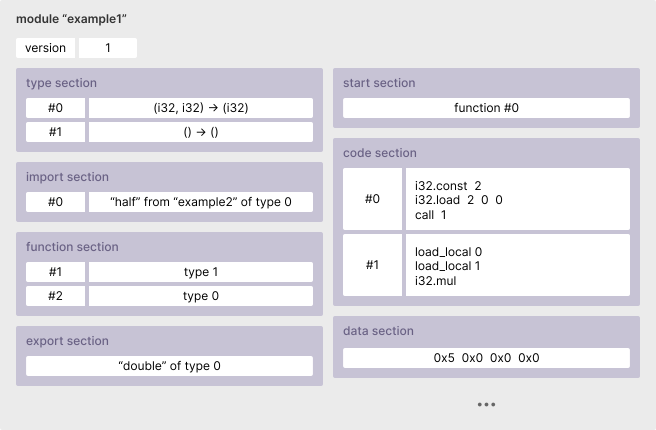
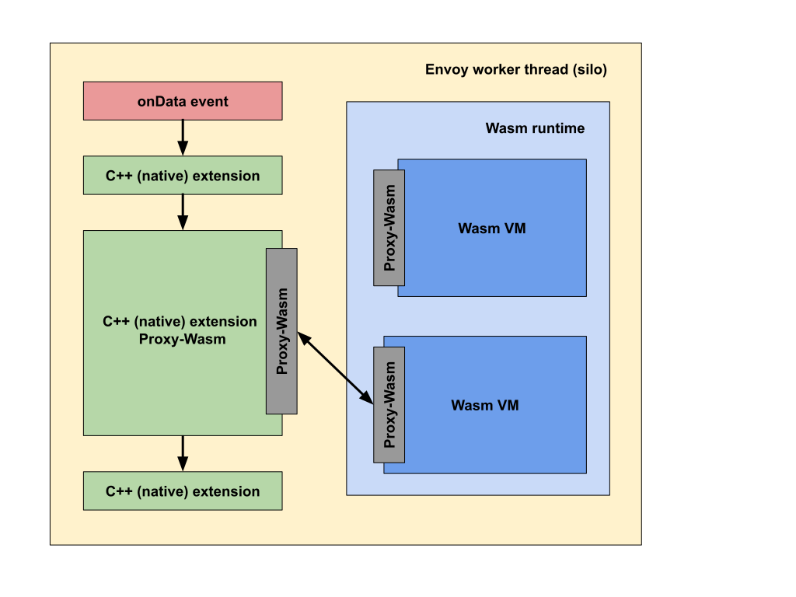

# Rust WebAssembly 101

@chikoski

PWA Night 2022/02/16

<!--
_class: lead
_paginate: false
-->

# https://bit.ly/rust-wasm-101

<!--
_class: lead
_pagenate: false
-->

# TL;DR;

- 既存のソフトウェア資産を使いまわせるのが WebAssembly の魅力
- Rust は Wasm 向けのプログラムを書きやすい言語の一つ
- 初めるなら wasm-pack を使うと良いように思う

~~~sh
% npm i -g wasm-pack
% wasm-pack new your_project
% cd your_project
% code .
% wasm-pack build
% wasm-pack pack
~~~

# Wasm とは

- バイナリーファイル
- モジュール定義
  - インポート
  - エキスポート
  - 関数定義
  - データー
  - etc



<!--
_footer: The image is cited from https://rsms.me/wasm-intro
-->

# JS から Wasm を利用するには

- Wasm ファイルをインスタンス化して利用する
- エキスポートされた関数は JS の関数と同様に扱える


``` javascript
const source = await fetch("wasm-module.wasm");
const imports = {
    debug: (number) => console.log(number),
};
const wasmModule = await WebAssembly.instantiateStreaming({imports}, source);

const sum = wasmModule.exports.add(1, 2);
const add = wasmModule.exports.add;
const anotherSum = add(3, 4);
```

# 利用目的 #1: エコシステム

- Wasm はコンパイルして作成する
  - 多くの場合。[手で書く強者](https://www.youtube.com/watch?v=qEq3F9Z8z6w)もいるが… 
  - [テキスト表現](https://developer.mozilla.org/ja/docs/WebAssembly/Understanding_the_text_format)
- 資産の利用：ソースコード, ライブラリ,ツール
- [Sonic Boom! Audio Programming on Android and Chrome (Google I/O'19)](https://www.youtube.com/watch?v=-GaD0RCp-Q0)  
- 例：[Squoosh](https://squoosh.app/), [AutoCad](https://www.youtube.com/watch?v=BfkL3WgOPdI), [Photoshp](https://web.dev/ps-on-the-web/)


<!--
_footer: https://unsplash.com/photos/pRJhn4MbsMM
-->

# 利用目的 #2: パフォーマス

- 常に速いというわけではない
   - ブラウザ組み込みの関数の方が速い
   - JS の方が速い場合も多い
- 安定したパフォーマンス
   - JIT に左右されない
   - パフォーマンスが読めるというのは利点
- 例：[Zoom](https://www.youtube.com/watch?v=nhTxJBgTywc&list=PLNYkxOF6rcIBhuGsbO6t8-OBE5-fVPe7K)


<!--
_footer: https://unsplash.com/photos/oWrZoAVOBS0
-->

# 利用目的 #3: セキュリティ

- サンドボックス内での実行
  - 安全な実行コードの生成
  - メモリ保護
  - アイソレーション
- 安全性とフレキシビリティとの良いとこどり
- 例：
[Proxy-wasm](https://mathetake.github.io/assets/pdfs/proxy-wasm-and-its-landscape.pdf), [Shopify App](https://shopify.engineering/shopify-webassembly), [Amazon Prime Video](https://www.amazon.science/blog/how-prime-video-updates-its-app-for-more-than-8-000-device-types)


<!--
_footer: https://unsplash.com/photos/7C8c-7fwk34
-->

# Wasm 向けの開発ができる言語は？

- メジャーな言語であれば大体対応している
- 成熟度はさまざま
  - ツール
  - バイナリーサイズ
  - API への対応
  - 仕様への対応
- [C/C++](https://emscripten.org//)、[Rust](https://rustwasm.github.io/book/)、[AssemblyScript](https://www.assemblyscript.org/), [C#](https://docs.microsoft.com/ja-jp/aspnet/core/blazor/host-and-deploy/webassembly?view=aspnetcore-6.0) は有力な候補

# Rust でのWeb アプリ開発のはじめかた

- [wasm-pack](https://rustwasm.github.io/wasm-pack/) の利用すると手軽にはじめられる
- 開発のながれ：
   1. wasm-pack で wasm モジュール用のプロジェクトを作成
   2. 作成したコードから npm モジュールを作成
   3. 作成した npm モジュールを Web アプリに組み込む
- [シェルスクリプト、cargo、npm、yarn でインストールできる](https://rustwasm.github.io/wasm-pack/installer/#)   
- 必要なツール：[Rust の開発環境](https://rustup.rs/)、[Node.js / npm](https://nodejs.org/)

# wasm-pack: プロジェクトの作成

- `wasm-pack new プロジェクト名` でプロジェクトが作成される
- ソースコードは src フォルダにある

~~~sh
% wasm-pack new hello_world
[INFO]: ⬇️  Installing cargo-generate...
🐑  Generating a new rustwasm project with name 'hello_world'...
⚠️   Renaming project called `hello_world` to `hello-world`...
🔧   Creating project called `hello-world`...
✨   Done! New project created /Users/chikoski/talks/20220216-wasm/samples/hello-world
[INFO]: 🐑 Generated new project at /hello_world
% cd hello_world
% ls
Cargo.toml  LICENSE_APACHE  LICENSE_MIT  README.md  src  tests
~~~

# エキスポートする関数の定義

- src/lib.rs に関数を定義する
- 関数をエキスポートするには
  1. 関数を定義する
  2. wasm-bindgen プラグマをつける
  3. pub キーワードをつける

```rust
#[wasm_bindgen]
pub fn add(a: u32, b: u32) -> u32 {
    a + b
}
```

# ビルドと npm パッケージの作成

- `wasm-pack build` でビルド
  - ビルドアーティファクトは pkg フォルダに作成される
  - Wasm ファイル以外に js, d.ts, package.json も作成される
- `wasm-pack pack` で npm パッケージを作成

```sh
% wasm-pack build -t web
% wasm-pack pack

% ls pkg/*.tgz
pkg/hello-world-0.1.0.tgz
```

# アプリへの組み込み

- 作成した tgz ファイルを Dependencies に追加する
- 初期化関数が default export に設定されている
- node_modules/モジュール名/*.wasm を適切に配置する

```js
import helloWorld, {add} from "hello-world"

async function main(){
  await helloWorld("配置した Wasm ファイルの URL");
  const sum = add(1, 2);
  console.log(`1 + 2 = ${sum}`);
}
```

# web_sys クレート: Web API の利用

- Wasm には標準ライブラリーが定められていない
- つまり Web API の利用には、準備が必要
   - API をラップした関数の用意
   - インスタンス化時に import を適切に設定する
   - JS <-> Rust のデータ変換を行う
- [web_sys](https://rustwasm.github.io/wasm-bindgen/web-sys/index.html) クレートはこれらを隠蔽する (e.g. [fetch の使用](https://rustwasm.github.io/wasm-bindgen/examples/fetch.html))

# web_sys: Cargo.toml へ依存関係を追加

- Cargo.toml に web_sys を[依存するクレートとして追加](https://doc.rust-lang.org/cargo/guide/dependencies.html)する
- [feature flag](https://doc.rust-lang.org/cargo/reference/features.html) に列挙された機能だけが利用できる

```toml
[dependencies.web-sys]
version = "0.3.4"
features = [
  'Document',
  'Element',
  'HtmlElement',
  'Node',
  'Window',
]
```

# web_sys: hello_world

- Window オブジェクトや Document は取得できない場合がある
- DOM 操作は失敗する場合がある

```rust
#[wasm_bindgen]
pub fn greet() -> Result<(), JsValue> {
    let window = web_sys::window().ok_or("No Window object found")?;
    let document = window.document().ok_or("No Document object found")?;
    let body = document.body().ok_or("document.body does not exist")?;
    let message = document.create_element("div")?;
    message.set_text_content(Some("Hello, world!"));
    body.append_child(&message)?;
    Ok(())
}
```

# DOM 操作は JS の方が簡潔に書ける

- greet 関数を JS で書くと次のように簡潔に書ける
- Wasm に DOM 操作をさせない方が良い？
- JS と Wasm との役割分担は課題
  - 変更可能性と（人員を含めた）メンテナンス性
  - コードサイズとロードパフォーマンス

```js
val message = document.createElement("div");
div.text = "Hello, world!";
document.body.appendChild(message);
```

# 例：プラグイン

- 「同じような処理」
  - 画像の圧縮 (e.g. Squoosh)
  - データの変換 
  (e.g. Wasm-proxy)
- ロードパフォーマンスへの影響が少ない？
- 既存資産を活かしやすい？



<!--
_footer: https://github.com/proxy-wasm/spec
-->

# まとめ

- WebAssembly はモジュール定義
- 既存資産の再利用が最大の利点  
- wasm-pack: Rust での Wasm 開発が手軽になる
- Wasm をどのように使うかは検討が必要
  - メンテナンス性
  - ロードパフォーマンスへの影響


