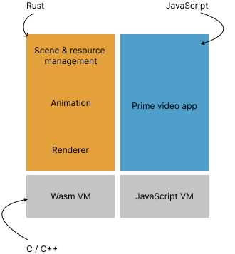
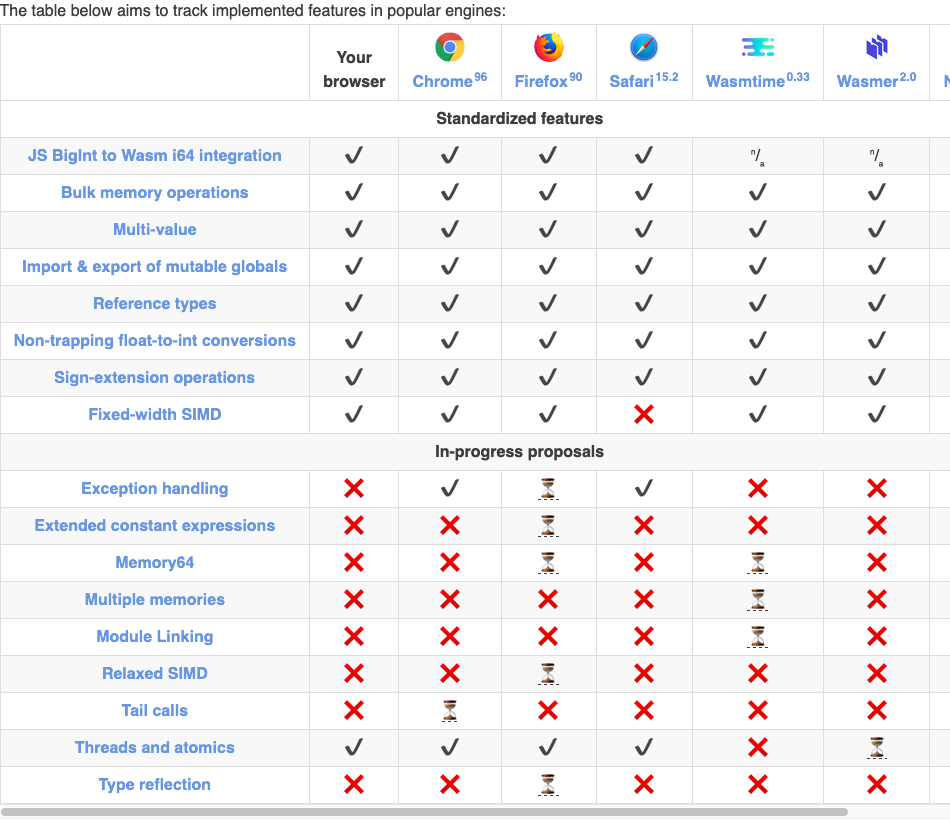
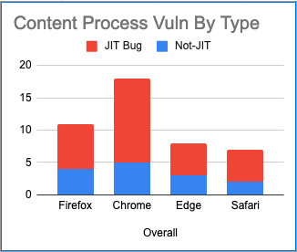

# WebAssembly 最近の話題から

@chikoski

2022/05/14 TechFeed Conference 2022
bit.ly/techfeed2022-wasm-01

<!--
_class: lead
_paginate: false
-->

# Wasm: 柔軟性と安全性

- 柔軟性
  - プログラミング言語やツールを選べる
  - 差し替えが（比較的）容易
- 安全性
  - 実行コードの生成
  - サンドボックス化した実行環境


<!--
_footer: Photo by [Ostap Senyuk](https://unsplash.com/@kintecus?utm_source=unsplash&utm_medium=referral&utm_content=creditCopyText) on [Unsplash](https://unsplash.com/)
-->


# Amazon Prime Video  

- ドングルやSTB向けアプリ
  - UI は JS で実現
  - 下回りは Wasm で実現
- 柔軟性
  - プロダクトの更新
  - 開発環境での差し替え
  - 開発言語の選択



<!--
_footer: c.f. [How Prime Video updates its app for more than 8,000 device types](https://www.amazon.science/blog/how-prime-video-updates-its-app-for-more-than-8-000-device-types)
-->

# 仕様の進化

- 種別
  - 初期のもの (MVP)
  - 追加されたもの
  - 議論進行中のもの
- Feature detection
  - [wasm-feature-dect](https://github.com/GoogleChromeLabs/wasm-feature-detect)
  - [Feature Detection Proposal](https://github.com/WebAssembly/feature-detection/blob/main/proposals/feature-detection/Overview.md)



<!--
_footer: The table came from [WebAssembly.org/roadmap](https://webassembly.org/roadmap/).
-->

# ESM integration: 使い勝手の向上

- Wasm インスタンスを JS のモジュールとして扱う
- Wasm のロードを ESM のロードの仕様に合わせる

```JS
//　従来のロード
const stream = fetch("./myModule.wasm");
const wasm = await WebAssembly.instantiateStreaming(stream, {});
wasm.instance.exports.foo();

// 統合後のロード
import { foo } from "./myModule.wasm";
foo();
```
<!--
_footer: The sample codes came from [WebAssembly ES Module Integration](https://docs.google.com/presentation/d/12cZ3FQizIJ7GGhegdSzRjnGp2l-gFsTlXfvUsAdN2No/edit#slide=id.p)
-->

# インタプリター

- 背景
  - [起動時間の短縮](https://docs.google.com/presentation/d/1QnlLXHaySUF3lJhQsOgMmsE4ynZiZx6kBMk4OAML-mY/edit#slide=id.p)
  - [セキュリティ](https://microsoftedge.github.io/edgevr/posts/Super-Duper-Secure-Mode/) / JIT 不可の環境  
  - 制限された資源下での利用
- 例：[JSC](https://www.youtube.com/watch?v=1v4wPoMskfo) / [DrumBrake](https://docs.google.com/document/d/1OIJ4Sv2XfTlI5NmTS1QI8v8wPL0LUT5s1W2D9OlJmMc/preview#) / [wasm3](https://github.com/wasm3/wasm3)



<!--
_footer: "The bar chart came from [an analysis by Mozilla]( https://docs.google.com/spreadsheets/d/1FslzTx4b7sKZK4BR-DpO45JZNB1QZF9wuijK3OxBwr0/edit#gid=865365202)"
-->