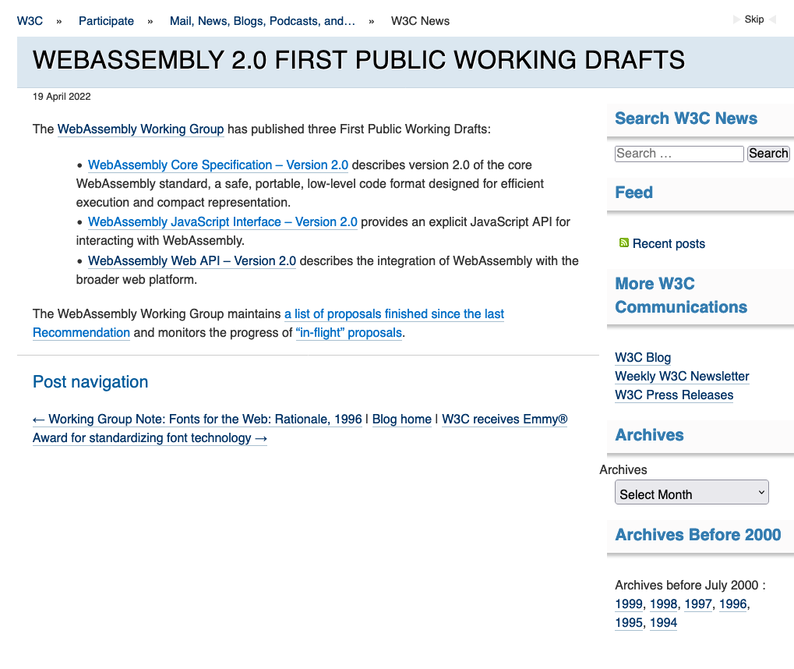

# WebAssembly 最近の話題より

@chikoski

2022/05/14 TechFeed Conference 2022
bit.ly/techfeed2022-wasm-01


<!--
_class: lead
_paginate: false
-->

# WebAssembly 2.0 workging drafts



# Specs


# AngryBots


<!--
_color: white
_footer: https://beta.unity3d.com/jonas/AngryBots/
-->

# 安全性と柔軟性の両立

- 安全性
  - サンドボックス化された実行環境
  - 3rd party code の実行
- 柔軟性
  - プログラミング言語選択の柔軟性
  - ツール選択の柔軟性
  - モジュールの更新が（比較的）容易


<!--
_footer: Photo by [Ostap Senyuk](https://unsplash.com/@kintecus?utm_source=unsplash&utm_medium=referral&utm_content=creditCopyText) on [Unsplash](https://unsplash.com/)
-->

# Shopify App


<!-- 
_footer: c.f. [What's a Shopify app?](https://shopify.dev/apps/getting-started)
-->

# RLBox

- [ライブラリ向けサンドボックス]((https://github.com/PLSysSec/rlbox))
- プロセス分離以外の選択肢
- [Firfox 95 以降で利用](https://hacks.mozilla.org/2020/02/securing-firefox-with-webassembly/)
- [Retrofitting Fine Grain Isolation in the Firefox Renderer](https://arxiv.org/abs/2003.00572)


<!--
_footer: c.f. [Building a secure by default, composable future for WebAssembly](https://bytecodealliance.org/articles/announcing-the-bytecode-alliance)
-->

# Amazon Prime Video  

- ドングルやSTB向けアプリ
  - UI は JS で実現
  - 下回りは Wasm で実現
- 柔軟性
  - プロダクトの更新
  - 開発環境での差し替え
  - 開発言語の選択


<!--
_footer: c.f. [How Prime Video updates its app for more than 8,000 device types](https://www.amazon.science/blog/how-prime-video-updates-its-app-for-more-than-8-000-device-types)
-->


# Wasm module を組み合わせて使う

<!--
_class: lead
_paginate: false
-->

# ESM integration: 使い勝手の向上

- Wasm インスタンスを JS のモジュールとして扱う
- Wasm のロードを ESM のロードの仕様に合わせる

```JS
//　従来のロード
const stream = fetch("./myModule.wasm");
const wasm = await WebAssembly.instantiateStreaming(stream, {});
wasm.instance.exports.foo();

// 統合後のロード
import { foo } from "./myModule.wasm";
foo();
```
<!--
_footer: The sample codes came from [WebAssembly ES Module Integration](https://docs.google.com/presentation/d/12cZ3FQizIJ7GGhegdSzRjnGp2l-gFsTlXfvUsAdN2No/edit#slide=id.p)
-->


# Component model

- Use cases: host embedding component, component composition

```LISP
(component
  (module $A
    (func (export "one") (result i32) (i32.const 1))
  )
  (module $B
    (func (import "a" "one") (result i32))
  )
  (instance $a (instantiate (module $A)))
  (instance $b (instantiate (module $B) (with "a" (instance $a))))
)
```

<!--
_footer: The sample code is cited from [Component Model Explainer](https://github.com/WebAssembly/component-model/blob/main/design/mvp/Explainer.md)
-->